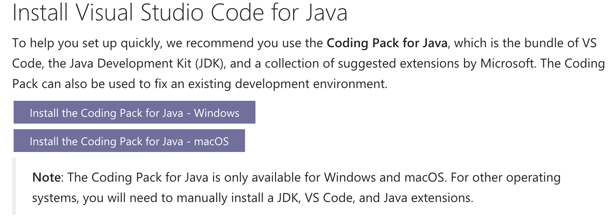

# APCSA Assignment 1 Instructions!
Author: Will Gass

## Instructions for Class Day 10/26/2023:

### For Ms. Mahuta --
1. Have students create GitHub account. I would recommend PERSONAL EMAIL!
2. Invite students to the GitHub classroom, then have them select their name from the roster.
3. Have students accept the link to the assignment and go to their own repo. From there, they should be ok to continue the instructions.

### What should I do if I run into issues?

First and foremost, consult the internet! Being able to troubleshoot your issues with the Google is a valuable skill to have. If you still have issues, put something in Discord. I will respond... eventually.

### Setting up VS Code
Luckily, Java makes this easy for Mac/Windows users. If that applies to you, go to https://code.visualstudio.com/docs/languages/java and follow the instructions there.
Download the coding pack for your appropriate operating system, let it install with the setup wizard, and then you should be finished for this section.

If you are on Chromebook, it looks like you have to take a couple extra steps. I haven't done this myself, so there may be some troublehsooting involved.
I also can't emulate this, so the best I can do is give you pointers.
Start at this page:
https://code.visualstudio.com/blogs/2020/12/03/chromebook-get-started
And follow the instructions from start to finish.

Now, go to this page and install our Java Development Kit:
https://learn.microsoft.com/en-us/java/openjdk/download/

At this point, you should be in the same position as Mac + Windows, so feel free to go to the next section. If not, we will need to find some time to troubleshoot.

### Downloading GitHub Desktop (Mac + Windows)
Github makes a desktop app that will make your life 1000x easier with this course.  
Navigate to https://desktop.github.com/, download the desktop app and install it. Ms. Mahuta can walk you through the setup involved, but it's important you sign in with the account you just created.  
Once you've done that, we can clone your student repo!! Click on the BIG GREEN '<> CODE' button, and then 'Open with GitHub Desktop'
If you've configured VS Code as your Code Editor with GitHub desktop, you should be able to edit 

### Using Git (Chromebooks)
GitHub doesn't have a desktop app for Linux, so this will be harder for you all. Much, much harder.  
Inside your linux terminal, run:  
`sudo apt update`  
`sudo apt install git`  
To verify this worked, run:  
`git --version`  
Next, run   
`git config --global user.name "YOUR NAME"`  
`git config --global user.name "YOUR EMAIL"`  
And replace "YOUR NAME" with your name, and "YOUR EMAIL" with the email you've used for your GitHub account.  
Almost done.  
Launch up a new instance of Linux terminal.   
Run the following commands:  
`mkdir AP-CSA`  
`cd AP-CSA`  
Now, click the BIG GREEN '<> CODE' button, click HTTPS, and then copy the link to your clipboard.  
Run the following command  
`git clone <LINK>`  
where <LINK> is the link you just copied.  
If it worked, you should see the new directory created when you run the `ls` command.  
Finished!  

### Installing Makefile

At this point, you should be working with VS Code.  
Specifically, for Windows and Mac, open the Repo from the GitHub desktop app with Visual Studio Code.  
If you're on Chromebook, launch Visual Studio Code, click open folder, and then click the directory that you just cloned.  

Once you have the directory open, the bottom part of the App should contain the terminal. We will using this for all assignments, specifically with Makefile.   
First, we need to download Makefile.   
Windows: https://gnuwin32.sourceforge.net/packages/make.htm  Download the Setup link next to "Complete package, except sources"  
Mac/Chromebook:  
run this command to install homebrew... something that makes install packages much easier. once we get to the end of the course and do fun stuff, I'm sure we'll use this again:  
`/bin/bash -c "$(curl -fsSL https://raw.githubusercontent.com/Homebrew/install/HEAD/install.sh)"`    
After that, run  
`brew install make`  

In your terminal in VS Code, now run  
`make --version` to verify this worked. You shuold see Make's version, probably 'GNU Make 3.81'  
Now the moment of truth, ... run:   
`make hello` and you should see "Hello, World!" as the last line of output. Congrats! You are now ready to do the assigment (ugh I know, there's more?!!?)  

## Assignment 1: Milkshake Class

### Your Job

Milkshake has returned from your nightmares. You have to write the Milkshake class as specified in the FRQ we gave out a couple days ago.   
I suggest writing your constructor and method signatures first, and then implementing them. Importantly, this will let your code compile!  

If you want to test your implementation, run:  
`make` or `make test`    
Results will be printed to your terminal, but also visible in RESULTS.txt.  

#### DO NOT EDIT ANY OTHER FILE BESIDES Milkshake.java! 

Feel free to explore how I implemented the testers, but don't, just don't, change them. I gave you access to the testers for your convenience, and changing the testers will not change the testers when I run them :)  

### Submission

Mac/Windows users, submit from GitHub desktop. Commit your changes by adding a message in the bottom left, and then hit 'Push Origin' after commiting.
Chromebook users, run the command: `make submit`. It should do the same thing.

